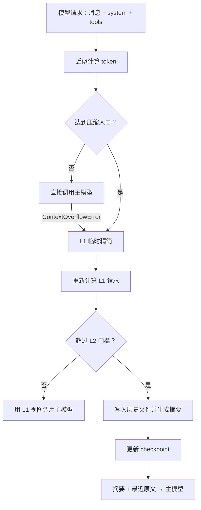

# 上下文压缩机制

长对话和大段工具结果会占用模型上下文。Yuxi 使用两级压缩：先为当前请求临时瘦身（L1），仍然过大时再把较早历史保存为文件并生成摘要（L2）。配置入口见[智能体配置](../agents/agents-config.md)，中间件顺序见[中间件](../agents/middleware.md)。

## 先记住三件事

1. PostgreSQL 中的聊天消息不会因为压缩被删除。
2. L1 主要修改本次模型请求的消息副本；模型发生 overflow 时，尾部裁剪也可能更新 checkpoint 的消息尾部，但不会删除 PostgreSQL 聊天记录。
3. L2 更新 checkpoint 的 `_summarization_event`，后续请求使用摘要加上未摘要的最近消息。

## 请求流程

入口阈值没有达到时，Yuxi 直接调用主模型。模型返回 `ContextOverflowError` 时，系统把它视为强制压缩信号，重新执行 L1，并在需要时进入 L2。

## L1：临时精简

L1 为本次模型请求创建较小的消息视图：

- `write_file` 和 `edit_file` 的过长参数截断为短提示；单次参数上限是 2,000 个字符；
- 超过 `summary_tool_result_token_limit` 的工具结果完整写入 `outputs/large_tool_results/`，请求中只保留路径和近似 token 上限内的预览；
- 文件名使用工具名和内容哈希，同一内容可以稳定定位；
- 正常 L1 不改写原始消息；overflow 路径的尾部裁剪可能更新 checkpoint 的消息尾部，但 PostgreSQL 聊天记录保持不变。

token 数使用近似计算，只用于决定何时压缩和预览多长，不是计费口径。L1 后低于 L2 门槛时，主模型直接使用这个临时视图，不生成摘要状态。

## L2：摘要和历史文件

L2 从较早历史中选择待摘要区间，优先保留 `summary_keep_messages` 条最近消息。选中的历史写入当前运行的 `outputs/conversation_history`，摘要模型根据这段历史生成一条 summary message。

成功后，`_summarization_event` 保存累计 cutoff、摘要消息和历史文件路径。后续请求根据这个事件跳过已摘要区间，只发送最新摘要和 cutoff 之后的消息。再次压缩时，局部 cutoff 会换算成完整 state 的位置。

如果历史文件写入失败，摘要仍可能继续，但被摘要的原文无法从文件恢复；如果摘要模型失败，系统会把错误文本作为摘要结果，主模型仍可能继续。需要判断结果时，同时检查 checkpoint 事件、历史文件内容、日志和同一 Run 的最终输出。

## 事件和可见性

上下文压缩会发送三个 custom event：

- `started`：开始压缩；
- `completed`：L1 或 L2 处理后主模型调用成功；
- `failed`：压缩过程中出现未处理异常。

`chat_service` 把它们映射为 SSE 的 `context_compression` 事件。SSE 只负责实时提示；可恢复的摘要状态以对应 Run 的 checkpoint 为准，历史内容以文件读取结果为准。内部摘要模型带有 `TAG_NOSTREAM`，不会作为用户可见的助手消息流出。

L1-only 的 `completed` 事件没有 L2 cutoff 和历史文件路径，消费者不要把它误判为生成了持久摘要。

## 配置字段

| 字段 | 默认值 | 作用 |
| --- | ---: | --- |
| `summary_threshold` | `100` | 压缩入口，单位 K，装配时换算为约 1024 倍 token |
| `summary_keep_messages` | `10` | L2 后优先保留的最近消息数 |
| `summary_prompt` | 内置中文模板 | 摘要提示词，必须包含 `{messages}` |
| `summary_tool_result_token_limit` | `300` | L1 工具结果的近似 token 阈值和预览上限 |
| `summary_l2_trigger_ratio` | `0.4` | L1 后触发 L2 的比例 |

配置页面的“摘要触发”表示请求进入压缩流程，实际结果可能只完成 L1。降低 `summary_l2_trigger_ratio` 会更早进入 L2；增加保留消息数会增加摘要后的请求体。修改参数后用典型工具输出和目标模型上下文窗口做实际验证。

## 文件、权限和用量

摘要文件和长工具结果写入当前运行的 Workdir `outputs`。主 Agent 和子 Agent 共享根执行树的文件作用域，因此子 Agent 也可能看到这些文件。文件内容可能包含完整工具返回和用户对话，应按用户数据保护。

路径仍由 Workspace/Sandbox backend 校验；公共 Skill 目录不可写，宿主机路径不会暴露给模型。文件写入过程不做脱敏或加密。

Summary 的触发使用近似 token 统计；主模型返回的 `usage_metadata` 用于实际用量记录，但 `siliconflow-cn` 和 `siliconflow` 当前被排除在 Provider 用量聚合之外。当前 `TokenUsageMiddleware` 也不统计内部摘要模型调用，因此这组数据不能直接作为完整账单。

## 失败和恢复时看什么

| 现象 | 先检查 |
| --- | --- |
| 事件显示开始但没有完成 | 同一 Run 的 error 事件、worker 日志和主模型错误 |
| 摘要后找不到旧内容 | checkpoint 的 `_summarization_event.file_path` 和 Workdir 中的历史文件 |
| 任务仍提示上下文过大 | L1 视图、保留消息数、工具 schema 和目标模型上下文上限 |
| 前端出现摘要文本 | 检查是否把内部摘要流误当成 messages 事件；正常路径应使用 `TAG_NOSTREAM` |

不要从相邻 Run 的摘要文件或消息推断当前 Run 的结果。

## 源码和验证入口

- [Summary middleware](https://github.com/xerrors/Yuxi/blob/main/backend/package/yuxi/agents/middlewares/summary.py)
- [Agent 配置](https://github.com/xerrors/Yuxi/blob/main/backend/package/yuxi/agents/context.py)
- [Chatbot graph](https://github.com/xerrors/Yuxi/blob/main/backend/package/yuxi/agents/buildin/chatbot/graph.py)
- [SubAgent graph](https://github.com/xerrors/Yuxi/blob/main/backend/package/yuxi/agents/buildin/subagent/graph.py)
- [SSE 和聊天服务](https://github.com/xerrors/Yuxi/blob/main/backend/package/yuxi/services/chat_service.py)
- [Token usage](https://github.com/xerrors/Yuxi/blob/main/backend/package/yuxi/agents/middlewares/token_usage.py)
- [Summary unit tests](https://github.com/xerrors/Yuxi/tree/main/backend/test/unit/middlewares)
- [Summary graph configuration tests](https://github.com/xerrors/Yuxi/blob/main/backend/test/unit/agents/test_summary_graph_config.py)
- [Real-model integration test](https://github.com/xerrors/Yuxi/blob/main/backend/test/integration/services/test_summary_middleware_real_model.py)

修改压缩逻辑时，至少验证低于入口、仅 L1、进入 L2、历史写入失败、摘要模型失败和 overflow 尾部裁剪；oracle 应读取消息视图、state update、文件或 SSE 协议结果。
