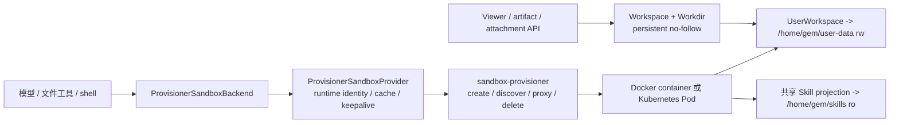

# 沙盒与文件系统机制

本文说明 Agent 文件与命令操作如何进入 execution Sandbox，以及 UserWorkspace、当前 Workdir、Skills、Viewer 和 provisioner 之间的边界。部署参数与排障见[沙盒配置与运维](../agents/sandbox-architecture.md)。

## 体系分层

Yuxi 沙盒由三个协作层组成：

1. Agent backend 控制模型可读写的虚拟路径，并为每次操作获取沙盒客户端。
2. `sandbox-provisioner` 以 execution runtime identity 创建、发现、代理和回收实际实例。
3. provisioner backend 由本机 Docker、Kubernetes Pod/Service 或仅供测试的 memory 记录承载。

模型和产品接口只使用虚拟路径。宿主机路径、容器虚拟路径和对象 URL 不可混用；路径解析必须在所属文件系统边界内拒绝 `..`、symlink 和跨 uid 访问。

## 运行链路

Graph 构建时，文件系统中间件用 `runtime_scope_id`、`uid` 和 `workdir_path` 创建 `ProvisionerSandboxBackend`。真实实例惰性创建；API/worker 只访问带 Bearer 认证的 provisioner 代理，不直接访问容器或 NodePort 地址。

Viewer、artifact 和附件服务不创建 file-bridge Sandbox。它们在鉴权后通过 `Workspace` 与持久化 `Workdir` 直接访问同一 UserWorkspace 字节，并把 Thread 操作限制在 Conversation 绑定的 Workdir 内。Viewer scope `/foo` 不经过 `/home/gem`；只有面向 Agent/artifact 协议的 Service 才调用 Backend 路径映射。

## identity、Workdir 与生命周期

`runtime_scope_id` 是 execution tree 的 Sandbox 分组键，当前等于根 Conversation 的 thread ID。根 Run 与子 Run 共享该值，因此共享进程、`/tmp`、依赖和环境；child `thread_id` 只属于子 Agent 的 LangGraph checkpoint。根执行树终态后，worker 通过既有 cleanup fence 删除 runtime，但不删除 UserWorkspace 文件。

Conversation 的 `workdir_path` 是 UserWorkspace 相对路径，例如 `projects/<uuid>`。它只选择 cwd 和 Thread 文件视图，不定义 runtime identity，也不是同一用户不同 Project 之间的文件授权边界。两个顶层 Conversation 即使绑定同一 Workdir，仍拥有不同 runtime。

| 运行类型 | checkpoint | runtime scope | Workdir |
|---|---|---|---|
| 普通 Agent | 当前 thread | 根 thread | 当前 Conversation 的 `workdir_path` |
| 子智能体 | child thread | 继承根 Run | 继承根 Conversation |
| 远程 Skill 拉取 | 临时 thread | 临时 thread | 无；`inherit_env=False` 且不挂持久卷 |

provider 的稳定 `sandbox_id` 只由 `uid + runtime_scope_id` 派生；同一 runtime 不能在存活期间重绑到另一个 `workdir_path`。独立的 `sandbox_instance_id` 和 `workdir-files-*` file bridge 已移除。

## 虚拟命名空间与文件 Owner

Sandbox 的持久挂载只有两个：

| 虚拟路径 | 宿主机或共享卷 Owner | 权限 | 用途 |
|---|---|---|---|
| `/home/gem/user-data` | `user-data/shared/<safe_uid>/workspace` | 读写 | 当前用户的整个 UserWorkspace |
| `/home/gem/skills` | `skill-projections/<safe_uid>` | 只读 | 当前用户获授权的共享与内置 Skill |

API、worker 与 Sandbox 内实际执行文件操作的服务统一使用数值身份 `1000:1000`。Sandbox 镜像仍以 root 完成受信任 bootstrap，再由 supervisor 把文件 API、shell、Jupyter 等数据面服务降权到 `gem:1000`；用户环境不能覆盖 `USER_UID/USER_GID`。storage migrator 是唯一保留 root 的持久文件写入入口，只在停机证明成立后一次性迁移旧所有权和权限，普通运行时不再用 world-writable mode 补偿跨 UID。

默认 Workdir 是 `/home/gem/user-data/projects/<uuid>`；`uploads/` 和 `outputs/` 是 Workdir 内按首次使用创建的目录约定，provisioner 不预建它们。个人 Skill 位于 `/home/gem/user-data/agents/skills/<slug>`，不复制到共享 projection。

整个 UserWorkspace 对同一 uid 的 Sandbox 可见，因而 Project A 可以读取 Project B。Prompt 要求 Agent 未经用户明确要求不得写入当前 Workdir 之外，但这只是默认行为约束，不是安全隔离。真正的授权边界是 uid 挂载、后端 ownership 查询和具体工具的文件根限制。

普通安全 UID 原样用作目录名；含不安全字符的身份只在文件系统边界转换为 `uid-<sha256>`。显式 `workdir_path` 必须是已存在的相对 POSIX 目录，不能指向保留的 `agents/`，所有组件按 root-to-leaf `O_NOFOLLOW` 打开。

知识库没有沙盒目录映射。Agent 通过 `query_kb`、`open_kb_document` 等工具访问；需要交付的文件写入当前 Workdir 后再展示。

## Docker 与 Kubernetes 承载

Docker backend 为每个 Sandbox 创建独立 bridge 网络，不发布容器端口，也不加入应用网络。`/home/gem` 使用临时 tmpfs；provisioner 只 bind mount 当前 uid 的 UserWorkspace 和只读 Skill projection。已发现实例必须精确匹配 uid、runtime thread、Workdir、网络和这两个持久挂载；存在旧 `/home/gem/projects`、嵌套 user-data 子挂载或可写 Skills 挂载时会拒绝复用。

Kubernetes backend 创建 Pod 与 NodePort Service。Pod 从 `USER_DATA_PVC` 的 `shared/<uid>/workspace` subPath 挂载 `/home/gem/user-data`，从 `SKILLS_PVC` 的 `skill-projections/<uid>` subPath 只读挂载 `/home/gem/skills`。远程 PVC 不经过 Compose storage migrator，因此 root init container 只对当前 uid 子树执行带 marker、dirfd 与 `O_NOFOLLOW` 的一次性 `1000:1000` 迁移，并创建必要的 subPath 根、验证权威 Workdir 已存在；它不创建 Workdir，也不预建 `uploads/outputs`。Docker backend 只验证 storage migrator/API 已创建的目录，不修改权限。User Data PVC 在跨节点部署时必须支持实际所需的共享读写语义。

Pod 设置 `automount_service_account_token=False`。Memory backend 只登记 URL，不创建隔离环境或准备目录，不能作为生产隔离承诺。

## 环境变量与信任边界

API/worker 使用 `SANDBOX_PROVISIONER_TOKEN` 调用 provisioner。该 token 至少 32 个字符，不能进入 `sandbox.env`、用户 Agent 环境或模型上下文。动态 Sandbox 默认获得全局 sandbox 环境和当前 uid 的 Agent 环境；远程 Skill 拉取传入 `inherit_env=False`，不注入这些环境，也不创建持久 uid 根。

provisioner 只需要 User Data 与 Skill projection 的显式宿主路径；旧 `DOCKER_PROJECTS_HOST_PATH` 与 `PROJECT_DATA_PVC` 已移除。`storage-migrator` 额外挂载 v0.7.1 的 `saves` 根，只用于停机迁移，不属于 shipping runtime。

## 失败、恢复与观察边界

| 现象 | 可以证明 | 不能证明 |
|---|---|---|
| provisioner `/health` 正常 | 进程与 backend 已初始化 | 某个 runtime 已创建或文件正确 |
| create/discover 返回代理 URL | 找到 identity 匹配的实例 | Workdir 内容和 Viewer 权限正确 |
| Viewer 能列出文件 | ownership 与宿主 no-follow 访问成功 | execution Sandbox 当前可用 |
| runtime 被 idle/终态回收 | 进程生命周期已结束 | UserWorkspace 文件被删除 |
| 迁移器成功 | schema、目标目录与路径改写通过回读 | 任意未来 Agent 行为正确 |

v0.7.1 的 `base.toml`、共享 Skill 与 thread `uploads/outputs` 只由 `storage-migrator` 在停机证明后导入。迁移先保留旧源完成目标复制，再切换 `workdir_path` 并回读数据库与最终目录，提交后才清理旧源；中断重试继续校验同一确定性目标。检测到未发布的 Workdir 中间 schema 时迁移明确失败。

## 源码定位与验证

- runtime identity 与生命周期：`backend/package/yuxi/agents/backends/sandbox/provider.py`
- Workdir/UserWorkspace 路径：`backend/package/yuxi/agents/backends/sandbox/paths.py`
- 受信任宿主文件访问：`backend/package/yuxi/services/workspace_filesystem.py`
- Thread 到 Workdir 授权：`backend/package/yuxi/services/workdir_service.py`
- Docker/Kubernetes provisioner：`docker/sandbox_provisioner/app.py`
- 一次性旧布局迁移：`backend/package/yuxi/storage_migration.py`

最小证据位于 sandbox、Workdir、Viewer、迁移相关 unit/integration，以及 Compose 工程契约。路径、挂载、identity 或清理语义变化时，还要验证真实 Docker/PVC 挂载和最终 POSIX 字节。
